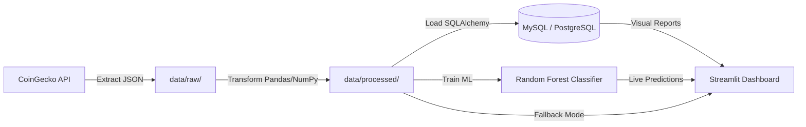

# Crypto Market Intelligence BI Pipeline

MADSC301 — Business Intelligence Final Assignment (Spring Semester 2026 Term III)
**EU Business School Munich** | Course: MADSC301 — Business Intelligence | Lecturer: Hachem Sfar

---

## Business Case & Objective

In the highly volatile cryptocurrency market, financial analysts and retail investors face massive noise and fragmented data. This Business Intelligence project builds an automated end-to-end data pipeline to extract, clean, store, analyze, and visualize market performance metrics. 

The pipeline tracks the top 100 cryptocurrencies by market capitalization to help users identify:
- **Top Gainers & Losers** over the last 24 hours.
- **Market Caps & Rankings** to analyze sector dominance.
- **Volatile Assets** via calculated daily trading bands.
- **Liquidity Health** using volume-to-market-cap ratios.
- **Market Categories** segmenting assets into Large-cap, Mid-cap, and Small-cap brackets.
- **Machine Learning Forecasts** predicting future price direction category (Up, Down, Neutral).

---

## Solution Architecture



1. **Data Collection (Extract)**: Requests data hourly from the public CoinGecko API. Raw JSON payloads are saved locally in `data/raw/` for transparency and archiving.
2. **Data Cleaning & Preparation (Transform)**: Standardizes numeric types, handles empty/missing values, removes duplicates, and computes advanced BI metrics (volatility, cap tiers, directions). Processed datasets are stored in `data/processed/`.
3. **Data Storage (Load)**: Loads the data into a MySQL (or PostgreSQL) database using an upsert mechanism (for dimensions) and snapshots (for facts) for time-series analysis.
4. **Machine Learning Classifier**: Trains a Random Forest model on processed features (volatility, volume ratio, rank) to predict the next price direction.
5. **Workflow Orchestration (Automation)**: Standardized task scheduling using Windows Task Scheduler (`run_pipeline.bat`) runs the pipeline at configured intervals.
6. **BI Dashboard (Visualization)**: A premium, dark-themed Streamlit application ([app.py](C:\Users\saiki\OneDrive\Documents\BI-Project\crypto-bi-etl-project\app.py)) presenting KPIs, charts, historical analysis, and ML predictions.

---

## Tech Stack

- **Language**: Python 3.13
- **Data Wrangling**: Pandas, NumPy
- **Database**: MySQL 8.0 (Natively supported) / PostgreSQL Fallback
- **Database Connector**: SQLAlchemy & PyMySQL / Psycopg2
- **Machine Learning**: Scikit-Learn (Random Forest)
- **Scheduler**: Windows Task Scheduler / Cron
- **Visualization & BI**: Streamlit (Premium dark UI) / Jupyter Notebooks

---

## Database Schema

The relational database is optimized using a Star-like schema design:

### 1. `dim_coin` (Dimension Table)
Stores descriptive details for each cryptocurrency.
- `coin_id` (VARCHAR(100), Primary Key): Unique API identifier (e.g., `bitcoin`).
- `symbol` (VARCHAR(20)): Ticker symbol (e.g., `BTC`).
- `name` (VARCHAR(100)): Display name.
- `market_cap_rank` (INTEGER): Current rank by market cap.

### 2. `fact_market_snapshot` (Fact Table)
Stores time-series price snapshots for analytical queries.
- `snapshot_id` (INT, Primary Key Auto-Increment)
- `coin_id` (VARCHAR(100), Foreign Key): References `dim_coin(coin_id)`.
- `snapshot_date` (DATE): Extraction date.
- `current_price_usd` (DOUBLE)
- `market_cap_usd` (DOUBLE)
- `total_volume_usd` (DOUBLE)
- `high_24h_usd` (DOUBLE)
- `low_24h_usd` (DOUBLE)
- `price_change_24h` (DOUBLE)
- `price_change_percentage_24h` (DOUBLE)
- `market_cap_change_percentage_24h` (DOUBLE)
- `volatility_24h` (DOUBLE): Calculated daily volatility index.
- `volume_to_market_cap_ratio` (DOUBLE): Calculated liquidity index.
- `price_direction` (VARCHAR(20)): Direction of price ('Up', 'Down', 'Neutral').
- `market_cap_category` (VARCHAR(20)): Category ('Large Cap', 'Mid Cap', 'Small Cap').
- `extracted_at` (TIMESTAMP): Precise extraction timestamp.

### 3. `etl_run_log` (Metadata/Logging Table)
Tracks pipeline performance and operational history.
- `run_id` (INT, Primary Key Auto-Increment)
- `run_timestamp` (TIMESTAMP): Log date.
- `status` (VARCHAR(20)): Run status (`SUCCESS` or `FAILED`).
- `rows_extracted` (INTEGER): Rows retrieved.
- `rows_loaded` (INTEGER): Rows loaded into fact table.
- `error_message` (TEXT): Stack trace in case of failure.

---

## Setup & Execution

### Step 1: Install Dependencies
Create a virtual environment and install the required libraries:
```bash
python -m venv .venv
.venv\Scripts\activate
pip install -r requirements.txt
```

### Step 2: Configure Environment Variables
Copy `.env.example` to `.env` and fill in your database credentials:
```env
DB_TYPE=mysql
DB_HOST=127.0.0.1
DB_PORT=3306
DB_NAME=crypto_bi_db
DB_USER=root
DB_PASSWORD=your_mysql_password_here
```
*Note: If the database `crypto_bi_db` does not exist on your server, the loader will automatically attempt to create it for you.*

### Step 3: Run the ETL Pipeline
To execute the pipeline manually:
```bash
python src/main.py
```
This runs extraction from CoinGecko, standardizes data, and loads it into your SQL database. In case of database failure, processed files are archived in `data/processed/latest.csv` and an alert is logged to `data/alerts.log`.

### Step 4: Run Machine Learning Model Training
Train the Random Forest Classifier on the extracted features:
```bash
python src/ml_model.py
```
This saves the trained model to `models/price_direction_rf.pkl`.

### Step 5: Launch the Streamlit Dashboard
To run the interactive visualization platform:
```bash
streamlit run app.py
```
*Note: The dashboard features a **Database-Offline Fallback Mode**. If the MySQL database is offline, it will automatically load data from local processed files (`data/processed/`), ensuring full visual rendering and testing functionality.*

---

## Workflow Orchestration (Scheduling)

To schedule the ETL pipeline on Windows:
1. Open **Windows Task Scheduler**.
2. Create a Basic Task named `Crypto_ETL_Pipeline`.
3. Set Trigger to **Daily** or **Hourly**.
4. Set Action to **Start a Program**.
5. Browse and select [run_pipeline.bat](C:\Users\saiki\OneDrive\Documents\BI-Project\crypto-bi-etl-project\run_pipeline.bat).
6. Under **Start in (optional)**, enter: `C:\Users\saiki\OneDrive\Documents\BI-Project\crypto-bi-etl-project`.
